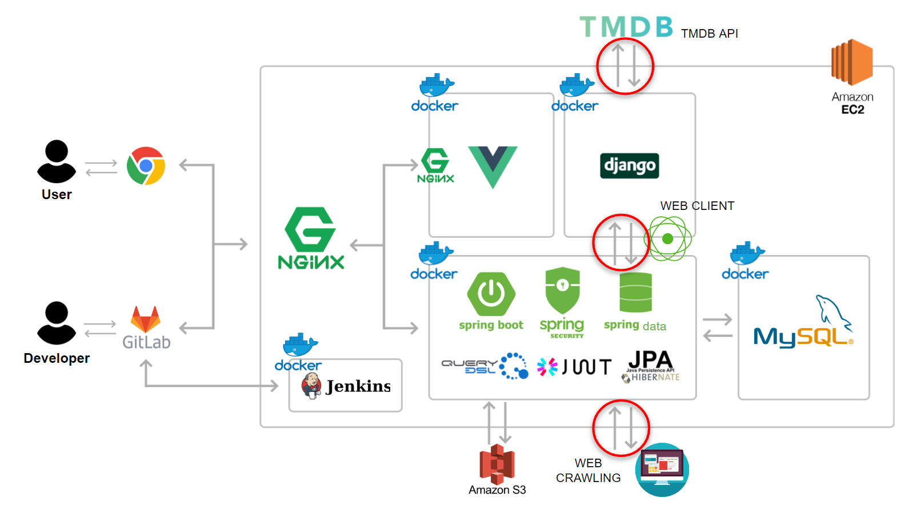
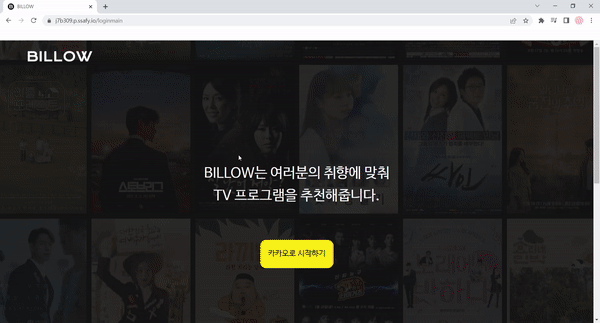
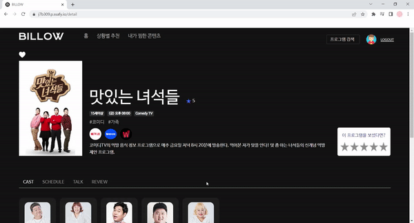
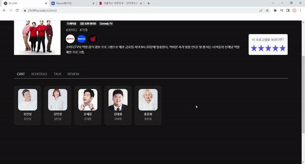
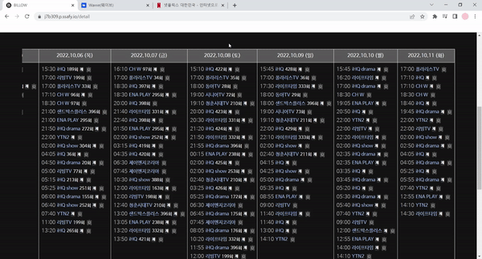

# 📺 사용자 맞춤 프로그램 추천 서비스, BILLOW

# 📋 프로젝트 소개

---

너무나도 많은 프로그램.. 오히려 무얼 볼지 고르기가 더 고민된다면?!

우리 BILLOW를 이용해보세요!

- 주요 기능
    - 사용자의 평점 데이터를 바탕으로 취향에 맞는 프로그램 맞춤 추천
    - 사용자의 기분과 상황에 따른 프로그램 추천
    - 사용자의 평점 등록 이력을 바탕으로 좋아하는 출연진을 분석 후 해당 출연진이 출연한 타 프로그램을 추천
    - 유저의 연령대 및 성별 맞춤 프로그램 추천
    - 프로그램 방영 SMS 알림
    - 프로그램 상세 조회시 OTT 서비스 연결 및 편성표 제공
- 주요 기술
    - pandas
    - numpy
    - scikit-learn

# 📜 프로젝트 정보

---

🔨 프로젝트 개발 환경 및 사용 기술 스택

| 구분 | 종류               | 기술스택           | 버전           |
| ---- | ------------------ | ------------------ | -------------- |
| BE   | IDE                | IntelliJ IDE       | -              |
|      |                    | Visual Studio Code | -              |
|      | Development-Java   | Java JDK           | oracle 11.0.15 |
|      |                    | SpringBoot         | 2.7.3          |
|      |                    | Spring Data JPA    | -              |
|      |                    | Swagger2           | 3.0.0          |
|      |                    | Spring Security    | -              |
|      |                    | Spring Validation  | -              |
|      |                    | MySQL              | 8.0.30         |
|      | Development-Python | Python             | 3.10.1         |
|      |                    | Django             | 3.2.7          |
|      |                    | Pandas             | -              |
|      |                    | Numpy              | -              |
|      | Build Tool         | Gradle             | -              |
|      | CI/CD              | AWS EC2            | -              |
|      |                    | Nginx              | -              |
|      |                    | Docker             | -              |
|      |                    | Jenkins            | -              |
| FE   | IDE                | Visual Studio Code | -              |
|      | Development        | Vue.js             | 3.2.13         |
|      |                    | Vuex               | 4.0.2          |
| 공통 |                    | GitLab             | -              |
|      | Issue              | Jira               | -              |
|      | Communication      | Notion             | -              |
|      |                    | Matermost          | -              |

## 🗂 서비스 아키텍처

---

# 🗃 프로젝트 결과물

---
### 1. 회원 가입 후 사용자의 취향 분석을 위한 프로그램 평점 등록

- 회원가입 후

  

- 사용자의 취향 분석을 위해 프로그램 평점 등록

  

### 2. 메인 화면

- 사용자별 맞춤 추천 프로그램을 볼 수 있다

  
- 나의 성/연령대에 맞춘 프로그램, 내가 자주 보는 프로그램에 출연하는 특정 배우의 필모그래피, 현재 방영중인 프로그램, 신규/인기 프로그램을 추천받을 수 있다

  

### 3. 상황별 프로그램 추천

- 현재 상황과 기분을 입력 후, 이런 상황에 과거에 시청한 프로그램을 고르면

  
- 해당 상황에서 볼 만한 프로그램을 추천해줍니다.

  
- 
### 4. 프로그램 상세 조회

- 프로그램의 방송사, 장르, 간단한 요약 등을 볼 수 있고, OTT에서 제공하는 프로그램일 경우 해당 OTT 아이콘을 선택하면 서비스 사이트로 이동한다.

  
- 즐겨찾기와 평점 등록이 가능하다.

  
- 하단 탭에서는 출연진, 현재 방송 편성표, 실시간 대화기능, 리뷰 등을 확인할 수 있다.

  

### 5. 방영 알림

- 방송 시작 15분 전 문자로 방영 알림을 제공하는 서비스를 이용할 수 있다.

  
# 👨‍👩‍👧‍👦 팀 소개

---

### 🎨Frontend

---

🧑🏻‍💻 안태환

- 컴포넌트 설계 및 구성
- 상황별 추천 UI 구현
- 카카오로그인/로그아웃
- 온에어/인기/신규 프로그램 API 연동
- 리뷰 수정 모달 기능 구현

🧑🏻‍💻 최재현

- 컴포넌트 설계 및 구성
- 메인 UI 구현
- 온에어톡, 리뷰 UI 구현
- 프로그램 상세 정보 UI 구현
- 유저 정보 수집 및 조회 UI 구현
- 로고, 배경 디자인 및 애니메이션 추가

### 💪🏽Backend & 🧠Core

---

👩🏻‍💻 김은경

- 웹 크롤링을 통한 데이터 수집 Scheduler 구현
- 사용자 성/연령별 프로그램 추천 API 구현
- 사용자 평점 기반 선호 출연진 프로그램 추천 API 구현
- 현재 방송 중인 프로그램 조회 API 구현
- 신규 프로그램 추천 API 구현
- 프로그램 상세 조회 API 구현
- 프로그램 편성표 API 구현
- 방영 알림 API 구현
- Nginx, Docker, Jenkins를 이용한 프로젝트 자동 배포
- (Front) REST API Axios 통신
- (Front) REST API Axios Interceptor 구현
- 포팅 매뉴얼, 배포 가이드 작성

👩🏻‍💻 박태이

- 상황에 맞는 프로그램 추천 API 구현
  - 협업 필터링 - 아이템 기반 필터링
- 회원 CRUD API 구현
- 평점, 리뷰 CRUD API 구현
- 즐겨찾기, 인기 프로그램 추천, 프로그램 검색 API 구현
- JWT, Spring Security 적용
- 문서화 담당
- UCC 기획 및 제작
- 발표 PPT 작성

🧑🏻‍💻 양지호

- Django - MySql 연결 셋팅
- 사용자 맞춤 프로그램 추천 API 구현
  - 협업 필터링 - SVD를  활용한 MF 알고리즘
- 추천 알고리즘 구현 메인 담당
- TMDB API를 통해 프로그램 데이터 가공 후 DB에 저장
- Web Client으로 Core(Django) - Backend(Spring) 통신
- 온에어톡 CRUD API 구현
- 발표 PPT 작성
- 시연 시나리오 작성
- 최종 발표 담당