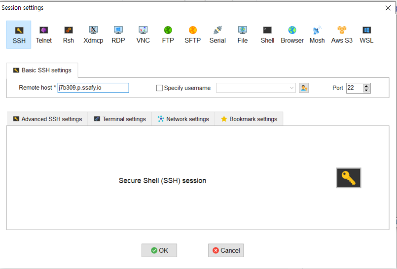
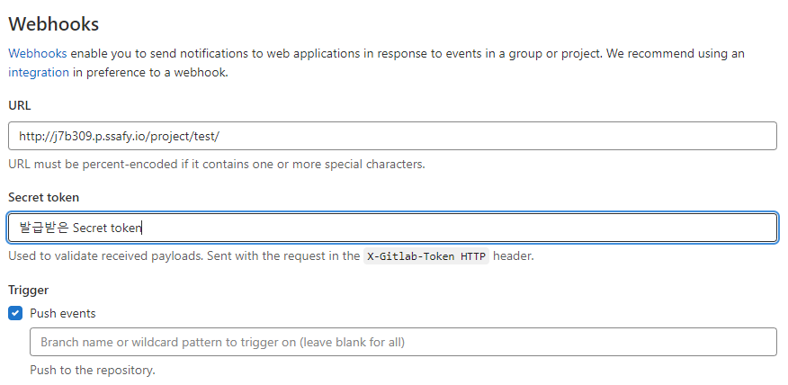

# 배포 가이드

BILLOW 배포 가이드입니다.

## 목차

1. [EC2 설정](##-🖥️-EC2-설정)
2. [DockerFile](##-🐬-DockerFile)
3. [Nginx 설정](##-⚙-Nginx-설정)
   <br>

## 🖥️ EC2 설정

### **EC2 접속**

<div>

</div>
<div>

</div>
<div>

</div>
<br>

### **Docker 설치**

- 패키지 설치
  ```
  $ sudo apt update
  $ sudo apt-get install -y ca-certificates \
    curl \
        software-properties-common \
        apt-transport-https \
        gnupg \
        lsb-release
  ```
- gpg 키 다운로드
  ```
  $ sudo mkdir -p /etc/apt/keyrings
  $ curl -fsSL https://download.docker.com/linux/ubuntu/gpg | sudo gpg --dearmor -o /etc/apt/keyrings/docker.gpg
  $ echo \
  "deb [arch=$(dpkg --print-architecture) signed-by=/etc/apt/keyrings/docker.gpg] https://download.docker.com/linux/ubuntu \
  $(lsb_release -cs) stable" | sudo tee /etc/apt/sources.list.d/docker.list > /dev/null
  ```
- Docker 설치

  ```
  $ sudo apt update
  $ sudo apt install docker-ce docker-ce-cli containerd.io docker-compose
  ```

### **젠킨스 설정**

- 젠킨스 컨테이너 생성

  - docker-compose.yml 파일

  ```
  $ vim docker-compose.yml
  ```

  ```
  version: '3'

  services:
    jenkins:
      image: jenkins/jenkins:lts
      container_name: jenkins
      volumes:
          - /var/run/docker.sock:/var/run/docker.sock
          - /jenkins:/var/jenkins_home
      ports:
          - "9090:8080"
      privileged: true
      user: root
  ```

  - 컨테이너 생성

  ```
  $ sudo docker-compose up -d
  $ sudo docker ps
  ```

  - Administrator password 확인

  ```
  $ sudo docker logs jenkins
  ```

  - 젠킨스 접속

    - http://서버주소:9090 접속
    - 플러그인 설치

### **젠킨스 프로젝트 생성**

- 프로젝트 생성
  <div>
  
  </div>

- 프로젝트 구성
  <div>
  
  </div>
- build branch 등록
  <div>
  
  </div>
- 빌드 유발
  <div>
  
  </div>
- Secret Token 발급
  <div>
  
  </div>
- Build Steps > Execute shell

  ```
  //사용하지 않는 이미지 삭제
  docker image prune -a --force

  //도커 이미지 압축파일을 저장할 폴더 생성
  mkdir -p /var/jenkins_home/images_tar

  cd /var/jenkins_home/workspace/billow/backend/billow/
  //도커 이미지 빌드
  docker build -t springboot .
  //도커 이미지를 압축하여 폴더에 저장
  docker save springboot > /var/jenkins_home/images_tar/springboot.tar

  cd /var/jenkins_home/workspace/billow/backend/djangoBack/
  //도커 이미지 빌드
  docker build -t django .
  //도커 이미지를 압축하여 폴더에 저장
  docker save django > /var/jenkins_home/images_tar/django.tar

  cd /var/jenkins_home/workspace/billow/frontend/
  //도커 이미지 빌드
  docker build -t vue .
  //도커 이미지를 압축하여 폴더에 저장
  docker save vue > /var/jenkins_home/images_tar/vue.tar

  ls /var/jenkins_home/images_tar

  //tar을 압축 해제하여 docker 이미지로 등록
  docker load < /var/jenkins_home/images_tar/vue.tar
  docker load < /var/jenkins_home/images_tar/springboot.tar
  docker load < /var/jenkins_home/images_tar/django.tar

  //컨테이너가 동작중이면 stop
  if (docker ps | grep "vue"); then docker stop vue; fi
  if (docker ps | grep "springboot"); then docker stop springboot; fi
  if (docker ps | grep "django"); then docker stop django; fi

  //컨테이너 생성하기 80 포트로 연결
  docker run -it -d --rm -p 8080:80 --name vue vue
  echo "Run vue"
  docker run -it -d --rm -p 8009:8009 --name springboot springboot
  echo "Run springboot"
  docker run -it -d --rm -p 8000:8000  --name django django
  echo "Run django"
  ```

### **GitLab WebHook**

- Setting→ Webhook 설정
  <div>
  
  </div>

### **젠킨스 컨테이너 Docker 설치**

- Ec2 접속 후

  ```
  $ sudo docker exec -it jenkins bash
  ```

- 패키지 설치

  ```
  $ apt update
  $ apt-get install -y ca-certificates \
     curl \
        software-properties-common \
        apt-transport-https \
        gnupg \
        lsb-release
  ```

- gpg 키 다운로드

  ```
  $ mkdir -p /etc/apt/keyrings
  $ curl -fsSL https://download.docker.com/linux/debian/gpg | gpg --dearmor -o /etc/apt/keyrings/docker.gpg

  $ echo \
  "deb [arch=$(dpkg --print-architecture) signed-by=/etc/apt/keyrings/docker.gpg] https://download.docker.com/linux/debian \
  $(lsb_release -cs) stable" | tee /etc/apt/sources.list.d/docker.list > /dev/null
  ```

- Docker 설치

  ```
  $ apt update
  $ apt install docker-ce docker-ce-cli containerd.io docker-compose
  ```

### **MySQL 설정**

- EC2 설정

  ```
  $ docker exec -it Billow /bin/bash
  $ docker run --name Billow -e MYSQL_ROOT_PASSWORD=[root 비밀번호] -d -p 3306:3306 mysql:8.0.30

  // mysql 접속
  $ mysql -u root -p

  // user 생성 및 권한 부여
  mysql> create user 'B309'@'%' identified by 'B309Billow'

  mysql> grant all privileges on *.* to 'B309'@'%' with grant option;
  ```

- Workbench 설정
  - 사용자 계정 생성
    <div>
    
    </div>
  - Connection 생성
    <div>
    
    </div>

## 🐬 DockerFile

### **SpringBoot**

```
FROM openjdk:11 AS builder
COPY gradlew .
COPY gradle gradle
COPY build.gradle .
COPY settings.gradle .
COPY src src
RUN chmod =x ./gradlew
RUN ./gradlew bootJar

FROM openjdk:11
COPY --from=builder build/libs/billow-0.0.1-SNAPSHOT.jar billow.jar

EXPOSE 8009
CMD ["java","-jar","/billow.jar"]
```

### **Django**

```
FROM python:3.10.1
WORKDIR /var/jenkins_home/workspace/billow/backend/djangoBack
COPY requirements.txt ./

RUN pip install --upgrade pip
RUN pip install -r requirements.txt
COPY . .
EXPOSE 8000
CMD ["gunicorn", "djangoBack.wsgi", "--bind", "0.0.0.0:8000"]
```

### **Vue**

```
FROM node:lts-alpine as build-stage
WORKDIR /app
COPY package*.json ./
RUN npm install
COPY . .
RUN npm run build

FROM nginx:stable-alpine
RUN rm -rf /etc/nginx/conf.d/defalut.conf
COPY --from=build-stage /app/nginx/default.conf /etc/nginx/conf.d/default.conf

RUN rm -rf /usr/share/nginx/html/*
COPY --from=build-stage /app/dist /usr/share/nginx/html

EXPOSE 80
ENTRYPOINT ["nginx", "-g", "daemon off;"]
```

## ⚙ Nginx 설정

### **Nginx 설치**

```
$ sudo apt update
$ sudo apt install nginx
```

### **default.conf**

- /etc/nginx/sites-available 경로에서 default 파일 열기

```server {
        listen 80 default_server;
        listen [::]:80 default_server;

        server_name j7b309.p.ssafy.io;
        return 301 https://j7b309.p.ssafy.io$request_uri;
}

server {

        # SSL configuration
        listen 443 ssl;
        listen [::]:443;
        server_name j7b309.p.ssafy.io;

        ssl_certificate /etc/letsencrypt/live/j7b309.p.ssafy.io/fullchain.pem;
        ssl_certificate_key /etc/letsencrypt/live/j7b309.p.ssafy.io/privkey.pem;
        include /etc/letsencrypt/options-ssl-nginx.conf;
        ssl_dhparam /etc/letsencrypt/ssl-dhparams.pem;

				//vue 경로
        location / {
                proxy_pass http://localhost:8080;
                proxy_redirect off;
                charset utf-8;

                proxy_set_header X-Real-IP $remote_addr;
                proxy_set_header X-Forwarded-For $proxy_add_x_forwarded_for;
                proxy_set_header Host $http_host;
                proxy_set_header X-Forwarded-Proto $scheme;
                proxy_set_header X-NginX-Proxy true;
		}
		//springboot 경로
		location /api {
                proxy_pass http://localhost:8009;
                proxy_redirect off;
                charset utf-8;

                proxy_set_header X-Real-IP $remote_addr;
                proxy_set_header X-Forwarded-For $proxy_add_x_forwarded_for;
                proxy_set_header Host $http_host;
                proxy_set_header X-Forwarded-Proto $scheme;
                proxy_set_header X-NginX-Proxy true;
        }
		//django 경로
		location /db {
                proxy_pass http://127.0.0.1:8000;
                proxy_redirect off;
                charset utf-8;

                proxy_set_header X-Real-IP $remote_addr;
                proxy_set_header X-Forwarded-For $proxy_add_x_forwarded_for;
                proxy_set_header Host $http_host;
                proxy_set_header X-Forwarded-Proto $scheme;
                proxy_set_header X-NginX-Proxy true;
        }
}:
```

### **Vue Nginx 설정**

- 프로젝트경로/nginx/default.conf

```
server {
        client_max_body_size 500M;

        location / {
                root /usr/share/nginx/html;
                index index.html;
                try_files $uri $uri/ /index.html;
        }
}
```
